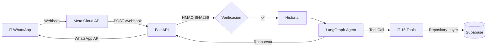

# 🧮 Quipu AI

> **Gerente Virtual para Tiendas de Ropa y Calzado** — Un asistente de IA que gestiona inventario y ventas por WhatsApp.

[](https://www.python.org/downloads/)
[](https://fastapi.tiangolo.com/)
[](LICENSE)

---

## 📋 ¿Qué es?

Quipu AI es un backend que conecta un **agente LLM** con **WhatsApp Business API** para que dueños de tiendas de ropa y calzado gestionen su negocio con lenguaje natural:

```
👤 "Vendí unas Vans negras talla 40 a Juan"
🤖 "✅ Venta registrada: 1x Vans Classic Negras T40 a Juan. Total: S/150.00"

👤 "¿Cuántas Nike Air Force blancas talla 42 me quedan?"
🤖 "Tienes 3 pares de Nike Air Force Blancas T42 en stock 👟"

👤 "Dame el reporte de ventas de esta semana"
🤖 [Imagen con gráfico de ventas] 📊
```

---

## 🏗️ Arquitectura



### Stack Tecnológico

| Capa | Tecnología | Justificación |
|---|---|---|
| **API** | FastAPI | Async, tipado, auto-docs |
| **Agente** | LangGraph + Groq (Llama 3.3, Mixtral) | ReAct pattern, cascada con fallback a OpenRouter |
| **Base de Datos** | Supabase (PostgreSQL) | REST API, auth, RLS |
| **Cache** | Redis | Historial de conversaciones, deduplicación |
| **Mensajería** | WhatsApp Business Cloud API | Canal principal |
| **Observabilidad** | structlog (JSON) | Logs estructurados para producción |
| **Testing** | pytest + pytest-mock + pytest-cov | 44+ tests (unit + integration) |
| **CI/CD** | GitHub Actions | Ruff lint + format + tests con coverage |
| **Gestión deps** | uv (Astral) | 10x más rápido que pip |

---

## 🔧 Tools del Agente (15)

| Tool | Descripción |
|---|---|
| `registrar_venta` | Registra ventas con variantes (talla, color) |
| `consultar_inventario` | Consulta stock con filtros |
| `consultar_metricas` | Métricas de ventas (hoy/semana/mes) |
| `generar_reporte_ventas` | Gráfico de barras de ventas (PNG) |
| `exportar_reporte` | Exporta ventas a CSV |
| `registrar_cliente` | Registra nuevo cliente |
| `registrar_compra_proveedor` | Ingresa mercadería al inventario |
| `alerta_stock_bajo` | Detecta productos con stock crítico |
| `enviar_catalogo` | Muestra catálogo con precios y stock |
| `registrar_deuda` | Registra créditos/deudas de clientes |
| `consultar_deudas` | Lista deudas pendientes de cobro |
| `recomendacion_personalizada` | Sugiere productos por historial |
| `buscar_web` | Búsqueda web con Tavily |
| `calcular_descuento` | Calcula descuentos y márgenes |
| `festividades_proximas` | Sugiere promos por feriados |

---

## 🚀 Quick Start

### Prerequisitos
- Python 3.11+
- [uv](https://docs.astral.sh/uv/) instalado
- Cuenta de [Supabase](https://supabase.com)
- API key de [Groq](https://console.groq.com)

### 1. Clonar e instalar

```bash
git clone https://github.com/atlaros/quipu-ai.git
cd quipu-ai
uv sync
```

### 2. Configurar variables de entorno

```bash
cp .env.example .env
# Editar .env con tus credenciales
```

### 3. Ejecutar

```bash
# Server
uv run uvicorn main:app --port 8000 --reload

# Tests
uv run pytest tests/ -v --cov=app
```

### 4. WhatsApp (opcional)

```bash
# Tunnel para exponer el server a Meta
ngrok http 8000

# Configurar la URL pública en Meta Developer > Webhook
```

---

## 📁 Estructura del Proyecto

```
quipu-ai/
├── app/
│   ├── agent/
│   │   ├── graph.py          # Grafo LangGraph (ReAct + cascada LLM)
│   │   └── state.py          # Estado del agente
│   ├── api/v1/
│   │   ├── chat.py            # POST /chat (test directo)
│   │   ├── clientes.py        # CRUD clientes
│   │   ├── health.py          # GET /health
│   │   ├── inventario.py      # CRUD inventario (talla, color, marca)
│   │   ├── productos.py       # CRUD productos con variantes
│   │   ├── ventas.py          # CRUD ventas
│   │   └── webhook.py         # WhatsApp webhook (HMAC + historial)
│   ├── core/
│   │   ├── config.py          # Settings (Pydantic)
│   │   ├── database.py        # Supabase client (singleton)
│   │   ├── exceptions.py      # Custom exceptions
│   │   └── logging.py         # structlog config
│   ├── repositories/          # Capa de datos (Supabase queries)
│   ├── services/              # Lógica de negocio + Redis + WhatsApp
│   └── tools/                 # 15 LangGraph tools
├── scripts/
│   ├── sql/                   # Migrations y schemas
│   └── verify/                # Scripts de verificación manual
├── tests/
│   ├── unit/                  # Tests unitarios (services + tools)
│   └── integration/           # Tests de integración (webhook flow)
├── .github/workflows/ci.yml   # GitHub Actions (lint + format + tests + coverage)
├── Dockerfile                 # Multi-stage (uv + slim)
├── main.py                    # App factory
└── pyproject.toml             # Dependencias + Ruff + mypy + pytest
```

---

## 🔗 API Endpoints

| Método | Endpoint | Descripción |
|---|---|---|
| `GET` | `/health` | Health check |
| `POST` | `/api/v1/chat/` | Chat directo con el agente |
| `GET` | `/api/v1/webhook/` | Verificación de Meta |
| `POST` | `/api/v1/webhook/` | Recibir mensajes de WhatsApp |
| `POST` | `/api/v1/ventas/` | Registrar venta |
| `GET` | `/api/v1/ventas/` | Listar ventas |
| `POST` | `/api/v1/productos/` | Crear producto (con variantes) |
| `GET` | `/api/v1/productos/` | Listar productos |
| `GET` | `/api/v1/inventario/` | Consultar stock por talla/color |
| `GET` | `/api/v1/clientes/` | Listar clientes |

📖 **Swagger UI**: `http://localhost:8000/docs`

---

## 🐳 Docker

```bash
# Build
docker build -t quipu-ai .

# Run
docker run -p 8000:8000 --env-file .env quipu-ai
```

---

## 🧪 Testing

```bash
# Todos los tests
uv run pytest tests/ -v

# Con coverage
uv run pytest tests/ --cov=app --cov-report=term-missing

# Solo tools
uv run pytest tests/unit/test_tools_*.py -v
```

---

## 📄 License

MIT
