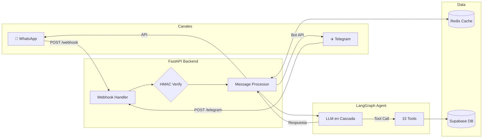

# 🧮 Quipu AI

> **Gerente Virtual para Tiendas de Ropa y Calzado** — Agente LLM multicanal (WhatsApp + Telegram) para gestión de negocio por lenguaje natural.

[](https://www.python.org/downloads/)
[](https://fastapi.tiangolo.com/)
[](https://langchain-ai.github.io/langgraph/)
[](tests/)
[](LICENSE)

---

## ¿Qué es?

Quipu AI es un backend de producción que conecta un **agente LLM con ReAct pattern** a **WhatsApp Business API** y **Telegram**, permitiendo a dueños de microempresas gestionar ventas, inventario y clientes usando lenguaje natural.

```
👤 "Vendí unas Vans negras talla 40 a Juan"
🤖 "✅ Venta registrada: 1x Vans Classic Negras T40 a Juan. Total: S/150.00"

👤 "¿Cuántas Nike Air Force blancas talla 42 me quedan?"
🤖 "Tienes 3 pares de Nike Air Force Blancas T42 en stock 👟"

👤 "Dame el reporte de ventas de esta semana"
🤖 [Imagen con gráfico de barras de ventas] 📊

👤 "¿Qué tallas de Adidas Ultraboost hay?"
🤖 "Ultraboost 22 — disponible en T40 (2u), T41 (1u), T43 (3u) 🏃"
```

### ¿Por qué este proyecto?

Las tiendas de barrio en Latinoamérica manejan su inventario en cuadernos o grupos de WhatsApp. Quipu AI convierte el canal de mensajería que **ya usan** en un sistema de gestión completo — sin curva de aprendizaje, sin apps nuevas que instalar.

---

## 🏗️ Arquitectura



### Stack Tecnológico

| Capa | Tecnología | Decisión |
|---|---|---|
| **API** | FastAPI | Async nativo, type-safe, auto-docs |
| **Agente** | LangGraph + ReAct | Ciclo razonamiento → acción → observación |
| **LLMs** | Groq (Qwen3-32B → Llama3.3-70B → Llama3.1-8B) + OpenRouter fallback | Cascada de 6 modelos para máxima disponibilidad |
| **Base de datos** | Supabase (PostgreSQL) | REST API, RLS, triggers nativos |
| **Cache** | Redis | Historial de conversación + deduplicación de mensajes |
| **Mensajería** | WhatsApp Business Cloud API + Telegram Bot API | Multicanal desde una sola arquitectura |
| **Observabilidad** | structlog (JSON estructurado) | Logs de producción con contexto automático |
| **Testing** | pytest + pytest-mock + pytest-cov | 79 tests (unit + integration) |
| **CI/CD** | GitHub Actions | Ruff lint + format + tests automáticos |
| **Deploy** | Render (Docker multi-stage) | Web service + Redis managed |
| **Gestión de deps** | uv (Astral) | 10× más rápido que pip, lockfile reproducible |

### Cascada de LLMs

El agente usa **fallback automático** entre 6 modelos para garantizar disponibilidad 24/7 sin depender de un solo proveedor:

```
Groq:        Qwen3-32B → Llama 3.3-70B → Llama 3.1-8B
                              ↓ si todos fallan
OpenRouter:  DeepSeek V3 → Nemotron 70B → OpenRouter Auto
```

---

## 🔧 15 Tools del Agente

| Tool | Descripción |
|---|---|
| `registrar_venta` | Registra ventas con variantes (talla, color) y actualiza stock |
| `consultar_inventario` | Consulta stock con filtros por nombre, talla y color |
| `enviar_catalogo` | Catálogo completo con precios y stock disponible |
| `alerta_stock_bajo` | Detecta productos con stock crítico para reabastecimiento |
| `registrar_compra_proveedor` | Ingresa mercadería nueva al inventario |
| `consultar_metricas` | KPIs de ventas: hoy / semana / mes |
| `generar_reporte_ventas` | Gráfico de barras de ventas en imagen PNG |
| `exportar_reporte` | Exporta historial de ventas a CSV descargable |
| `registrar_cliente` | Crea perfil de cliente con datos de contacto |
| `registrar_deuda` | Registra ventas a crédito de clientes |
| `consultar_deudas` | Lista deudas pendientes de cobro por cliente |
| `recomendacion_personalizada` | Sugiere productos basado en historial del cliente |
| `buscar_web` | Búsqueda web con Tavily (tendencias, competencia, precios externos) |
| `calcular_descuento` | Calcula precio final con descuento y margen |
| `festividades_proximas` | Sugiere promociones basadas en feriados y fechas especiales |

---

## 🚀 Quick Start

### Prerrequisitos
- Python 3.11+
- [uv](https://docs.astral.sh/uv/) instalado
- Cuenta de [Supabase](https://supabase.com)
- API key de [Groq](https://console.groq.com) (free tier funciona)

### 1. Clonar e instalar

```bash
git clone https://github.com/atlaros/quipu-ai.git
cd quipu-ai
uv sync
```

### 2. Variables de entorno

```bash
cp .env.example .env
# Completar .env con tus credenciales (ver .env.example para referencia)
```

### 3. Ejecutar

```bash
# Servidor local con hot-reload
make run-local

# Tests con coverage
make test

# Lint y formato
make lint
```

### 4. Conectar WhatsApp o Telegram (opcional)

```bash
# Exponer el servidor local con ngrok
make ngrok

# WhatsApp: configurar la URL en Meta Developer Portal > Webhooks
# Telegram: registrar el webhook
#   https://api.telegram.org/bot<TOKEN>/setWebhook?url=https://tu-url.ngrok.io/api/v1/telegram/webhook
```

---

## 📁 Estructura del Proyecto

```
quipu-ai/
├── app/
│   ├── agent/
│   │   ├── graph.py              # Grafo LangGraph (ReAct + cascada LLM)
│   │   └── state.py              # Estado tipado del agente
│   ├── api/
│   │   ├── dependencies.py       # Inyección de dependencias (FastAPI)
│   │   └── v1/
│   │       ├── chat.py           # POST /chat (endpoint de prueba directo)
│   │       ├── clientes.py       # CRUD clientes
│   │       ├── health.py         # GET /health
│   │       ├── inventario.py     # CRUD inventario (talla, color, marca)
│   │       ├── productos.py      # CRUD productos con variantes
│   │       ├── telegram_webhook.py  # Webhook Telegram (HMAC + dedup)
│   │       ├── ventas.py         # CRUD ventas
│   │       └── webhook.py        # Webhook WhatsApp (HMAC + historial)
│   ├── core/
│   │   ├── config.py             # Settings centralizados (pydantic-settings)
│   │   ├── database.py           # Supabase client (singleton async)
│   │   ├── exceptions.py         # Custom exceptions
│   │   └── logging.py            # structlog config (JSON en prod)
│   ├── models/                   # Pydantic schemas (request/response)
│   ├── repositories/             # Capa de datos (Supabase queries)
│   ├── services/                 # Lógica de negocio
│   │   ├── message_processor.py  # Orquestador de mensajes multicanal
│   │   ├── redis_service.py      # Cache + deduplicación
│   │   ├── telegram_service.py   # Integración Telegram Bot API
│   │   └── whatsapp_service.py   # Integración WhatsApp Cloud API
│   └── tools/                    # 15 LangGraph tools
├── tests/
│   ├── conftest.py               # Fixtures compartidas
│   ├── unit/                     # Tests unitarios (services + tools)
│   └── integration/              # Tests de integración (webhook flow)
├── scripts/
│   └── sql/                      # Schemas SQL (Supabase)
├── .github/workflows/ci.yml      # GitHub Actions (lint + tests + coverage)
├── Dockerfile                    # Multi-stage: builder (uv) + runtime (slim, non-root)
├── docker-compose.yml            # App + Redis para desarrollo local
├── render.yaml                   # IaC para deploy en Render
├── Makefile                      # install · run-local · run-docker · test · lint
├── main.py                       # App factory (FastAPI)
└── pyproject.toml                # Deps + Ruff + mypy + pytest config
```

---

## 🔗 API Endpoints

| Método | Endpoint | Descripción |
|---|---|---|
| `GET` | `/healthz` | Health check (Render probe) |
| `GET` | `/api/v1/health` | Health check detallado |
| `POST` | `/api/v1/chat/` | Chat directo con el agente (testing) |
| `GET` | `/api/v1/webhook/` | Verificación de Meta |
| `POST` | `/api/v1/webhook/` | Recibir mensajes WhatsApp |
| `POST` | `/api/v1/telegram/webhook` | Recibir updates de Telegram |
| `POST` | `/api/v1/ventas/` | Registrar venta |
| `GET` | `/api/v1/ventas/` | Listar ventas |
| `POST` | `/api/v1/productos/` | Crear producto con variantes |
| `GET` | `/api/v1/productos/` | Listar productos |
| `GET` | `/api/v1/inventario/` | Consultar stock filtrado |
| `GET` | `/api/v1/clientes/` | Listar clientes |

📖 **Swagger UI**: `http://localhost:8000/docs` (disponible en desarrollo)

---

## 🐳 Docker

```bash
# Desarrollo local (app + Redis)
docker compose up -d

# Solo la API
docker build -t quipu-ai .
docker run -p 8000:8000 --env-file .env quipu-ai

# Vía Makefile
make run-docker
```

---

## ☁️ Deploy

El proyecto incluye `render.yaml` para deploy completo en [Render](https://render.com):

- **Web Service**: Docker multi-stage con la API FastAPI (usuario no-root)
- **Redis**: Instancia managed para caché de conversaciones y deduplicación
- **Health Check**: `/healthz` — Render la sondea cada 30 segundos
- **Variables de entorno**: gestionadas desde el dashboard de Render (`sync: false`)

```bash
# Deploy automático al hacer push a master (vía GitHub + Render)
git push origin master
```

---

## 🧪 Testing

```bash
# Suite completo con coverage
make test

# O manualmente
uv run pytest tests/ -v --cov=app --cov-report=term-missing

# Solo tools del agente
uv run pytest tests/unit/test_tools_all.py -v

# Solo services
uv run pytest tests/unit/test_*_service.py -v

# Solo integración (webhook flow)
uv run pytest tests/integration/ -v
```

---

## 📄 License

MIT
